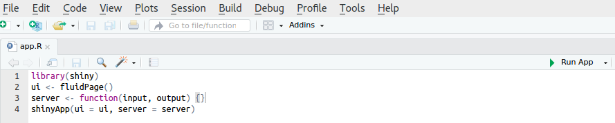

### 1. Intro

Shiny is a package from RStudio that can be used to build interactive web pages with R. It is meant to R users who have no experience with web development, and you do not need to know any HTML/CSS/JavaScript.

You can do quite a lot with Shiny: think of it as an easy way to make an interactive web page, and that web page can interact with R and display R objects (tables, plots or anything else you do in R). To get a sense of the wide range of things you can do with Shiny, you can visit [my Shiny server](http://gerinberg.com/shiny), which hosts some of my Shiny apps.

This tutorial is a hands-on activity for learning how to build a Shiny app. In this activity, we will walk through the steps of building a Shiny app using a dataset that lets you explore the prices of cryptocurrencies in the last months. The app can be seen [here](https://ginberg.shinyapps.io/crypto)

This tutorial should take approximately an hour to complete. If you want even more practice, another great tutorial is the official [Shiny tutorial](http://shiny.rstudio.com/tutorial).

#### Getting started

You will need to have the shiny package, so install if you have not done it yet:

install.packages("shiny")
To ensure you successfully installed Shiny, try running one of the demo apps.

library(shiny)
runExample("01_hello")
If the example app is running, press Escape to close the app, and you are ready to build your first Shiny app!

Exercise: Visit [ShowMeShiny](https://ShowMeShiny.com), which is a gallery of user-submitted Shiny apps, and click through some of the showcased apps. Get a feel for the wide range of things you can do with Shiny.

### 2. Shiny app basics

Every Shiny app is essentially composed of two parts: a web page that shows the app to the user, and a part that generates the content for that webpage. The app can either run on your laptop (such as when you’re running an app from RStudio) or on a computer somewhere else. You, as the Shiny app developer, need to write these two parts. In Shiny terminology, they are called UI (user interface) and server.

UI is just a web document that the user gets to see, it’s HTML that you write using Shiny’s functions. The UI is responsible for creating the layout of the app and telling Shiny exactly where things go. The server is responsible for the logic of the app; it’s the set of instructions that tell the web page what to show when the user interacts with the page.

If you look at the app we will be building, the page that you see is built with the UI code. You’ll notice there are some controls that you, as the user, can manipulate. If you adjust the cryptocurrencies or change the start data, you’ll notice that the plot get's updated. The UI is responsible for creating these controls and telling Shiny *where* to place the controls and where to place the plot, while the server is responsible for creating the actual plot.

### 3. Create an empty Shiny app

All Shiny apps, no matter how complex, follow the same pattern:

```
library(shiny)
ui <- fluidPage()
server <- function(input, output) {}
shinyApp(ui = ui, server = server)
```

This piece of code is a minimal Shiny app that doesn’t do much. It initializes an empty UI and an empty server, and runs an app using these empty parts. Copy this template into a new file named app.R in a new folder. A few things you should keep in mind:

- It is very important that the name of the file is app.R, otherwise it will not be recognized as a Shiny app.
- You should not have R code after the shinyApp(ui = ui, server = server) line,  that line needs to be the last line in your file.
- It is good practice to place this app in its own folder, and not in a folder that already has other R scripts or files, unless those other files are used by your app.
- After saving the file, RStudio should recognize that this is a Shiny app, and you should see the usual Run button at the top change to Run App.

If you don’t see the Run App button, it means you either have a very old version of RStudio, don’t have Shiny installed, or didn’t follow the file naming conventions.



#### Start & Stop the app 

Click the Run App button, and now your app should run. You won’t see much because it’s an empty app, but you should see that the console has some text printed in the form of

Listening on http://127.0.0.1:5219

and that a little stop sign appeared at the top of the console. You’ll also notice that you can’t run any commands in the console. This is because R is busy: your R session is currently powering a Shiny app and listening for user interaction (which won’t happen because the app has nothing in it yet).

Click the red stop button to stop the app, or press the Escape key.

You may have noticed that when you click the Run App button, all it’s doing is just running the function shiny::runApp() in the console. You can run that command instead of clicking the button if you prefer. However, do not place the runApp() function inside the shiny app code!

Exercise: Try running the empty app using the runApp() function instead of using the Run App button.

#### 3.1 Alternate way to create a Shiny app: separate UI and server files

Another way to define a Shiny app is by separating the UI and server code into two files: ui.R and server.R. This is the preferable way to write Shiny apps when the app is complex and involves more code, but in this tutorial we will be using the single file approach for simplicity.

If you want to break up your app into these two files, you simply put all code that is assigned to the ui variable in ui.R and all the code assigned to the server function in server.R. When RStudio sees these two files in the same folder, it will know you’re writing a Shiny app. Note that if you use this method (instead of having one app.R file), then you do not need to include the shinyApp(ui = ui, server = server) line.

Exercise: Try making a new Shiny app by creating the two files ui.R and server.R. Rememeber that they have to be in the same folder. Also remember to put them in a new, isolated folder (not where your app.R already exists).

#### 3.2 Let RStudio generate a Shiny app template

You can also create a new Shiny app using RStudio’s menu by selecting File > New File > Shiny Web App…. If you do this, RStudio will let you choose if you want a single-file app (app.R) or a two-file app (ui.R+server.R). RStudio will initialize a simple functional Shiny app with some code in it. I personally don’t use this feature because I find it easier to simply type the few lines of a Shiny app and save the files.

### 4. Load the dataset

The dataset we’ll be using contains information about cryptocurrency prices of the last months. I have downloaded this data from the website [Coinmarketcap](https://coinmarketcap.com)

[Download it](https://github.com/ginberg/crypto/blob/master/crypto-data.csv) now and place this file in the same folder as your Shiny app. Make sure the file is named crypto-data.csv.

Add a line in your app to load the data into a variable called crypto. It should look something like this

crypto <- read.csv("crypto-data.csv", stringsAsFactors = FALSE)

Place this line in your app as the second line, just after library(shiny). Make sure the file path and file name are correct, otherwise your app won’t run. Try to run the app to make sure the file can be loaded without errors.

If you want to verify that the app can successfully read the data, you can add a print() statement after reading the data. This will print the output of the file to the console (nothing will be seen yet in the user interface!), which should let you know that the dataset was indeed loaded correctly. You can place the following line after reading the data:

print(str(crypto)) 
Once you get confirmation that the data is properly loaded, you can delete that line.

Exercise: Load the csv file into R and have a look at the content. How big is it, what variables are there, etc.

### 5. [UI] Build the UI

Let’s start with creating the User Interface (UI). When creating a shiny app, this is usually the first step.

#### 5.1 Add a title

Shiny has a function titlePanel() to create a title for your application. When using this function it adds the title to the top of the page. Next to this, it will set the title of the web page. So, you will see this title, when looking at the name of the tab in your browser. 

Overwrite the fluidPage() that you have added before, so it has a titlePanel like below:

```
fluidPage(
  titlePanel("Cryptocurrency Dashboard")
)
```

#### 5.2 Add Layout

We need a way to structure our input elements on the page. In shiny, we can use different Layouts to achieve a certain structure. On [this page](https://shiny.rstudio.com/articles/layout-guide.html) you can find a detailed description. For now, we will use a simple and populair layout, called the sidebarLayout. In this layout, part of the screen is dedicated to a sidebar which is meant for your inputs. The other part of the screen contains the output, in our case this will be a chart.

Add the following code after the titlePanel()

```
sidebarLayout(
  sidebarPanel(""),
  mainPanel("")
)
```

Inside the fluidPage() function, all arguments need to be separated by a comma, so make sure you add a comma after the titlePanel.

### 6. [UI] Adding inputs

To make our application interactive, we are going to add inputs. These inputs enable us to filter the data in the way we want. Below, you see which inputs can be used with Shiny.


#### 6.1 Add the cryptocurrency input

The first input we want is to filter on the crypto currencies. My dataset contains data about the currencies Bitcoin, Ethereum, LiteCoin, Stellar, Neo, EOS and ChainLink. But what if you are only interested in Bitcoin and Ethereum? 
When looking at the available inputs, the best input is the selectInput(). Please see the help of this function for a moment with ?selectInput(). What arguments should we supply?

The first argument is the **inputId**, you will find this parameter in all inputs since each input should be unique. Furthermore the inputId is important since we will use it in the server to reference this input. The next argument is the label, this one is also found in most input elements and the contents of this field will be showed on our page.
The third parameter is called **choices**, it is used to specify all the items in this input. The (optional) **selected** parameter can be used to specify which items should be selected when the application starts. It should be a subset of the choices parameter. By default you can only select one item, however using the parameter **multiple** we can change this.
Add the code below inside your sidebarPanel.

```
selectInput('selectCoins', 
            'Select crypto(s)',
             choices = c("bitcoin", "ethereum", "litecoin", "neo"), 
             selected = c("bitcoin", "ethereum"), multiple = T)
```


#### 6.2 Add the Market Cap / Price input

We can look at different metrics regarding currencies, like Price, Market Cap, number of coins, etc. To select which metric we are interested in, we will use another selectInput. For now we will only add the Price and Market Cap to it. 
Please add the code below after the first input, separated by a comma.

```
selectInput('selectOutput', 
            'Select output', 
             choices = c('Market Cap' = "market", Price = "price"))
```

#### 6.3 Add the Date input

We all know that the cryptocurrency market is volatile, so it's important to be able to select a certain period in time. Shiny has a dataRangeInput that we can use to specify a start and end date.

Can you find out how to create this dateRangeInput (hint: use ?dateRangeInput())?

It should look the code below, I hope you had something similar. So, go ahead and add this after the other inputs.  
```
dateRangeInput('selectDate', 
               'Select date', 
                start = min(crypto$Date), 
                end = max(crypto$Date)),
```

#### 6.4 Add the Plot placeholder


#### 6.5 Code so far

Your code should like this now.

```
library(shiny)
crypto <- read.csv("crypto-data.csv", stringsAsFactors = FALSE)

ui <- fluidPage(
  titlePanel('Cryptocurrency dashboard'),
  sidebarLayout(
    sidebarPanel(
      selectInput('selectCoins', 'Select crypto(s)', choices = c("BTC", "ETH", "LTC"), multiple = T),
      selectInput('selectOutput', 'Select output', choices = c('Market Cap' = "market", Price = "price")),
      dateRangeInput('selectDate', 'Select date', start = min(crypto$Date), end = max(crypto$Date))
    ),
    mainPanel(dygraphOutput("priceGraph"))
  )
)

server <- function(input, output) {}

shinyApp(ui = ui, server = server)
```

### 7. [Server] Server concepts

Until now,we only wrote code that created the user interface and the placeholder for the graph. If you would have 2 files for the app, everything so far would be in ui.R. 
Now we will write the server function, which is responsible for listening to changes to the inputs and creating the output in the app. Usually, this is the more difficult part of the application to write.

If you look at the server function, you’ll notice that it is always defined with (at least) two arguments: ***input*** and ***output***. These two arguments are always required! 
Both of the arguments are lists. Input is a list that you can use to read the values from the input components at a given time. So, for example, when a user changes the selectInput of currencies, the value of this item in the input list will change.
Output is a list where you will save your output objects to. These output objects could be tables, graphs, etc. In our application, we will just write one graph to the output.

#### 7.1 Reactivity

Shiny uses a concept called ***Reactivity***, which is used in reactive programming. It is a programming style, just like Object-Oriented or Functional programming. Reactivity in Shiny is not easy, but it is very important to understand this. It took me a while to work with it, but now I really like it.

Basically, what reactivity does is to enable your outputs to react to changes in inputs. This means that when the value of a variable x changes, then anything that relies on x gets re-evaluated. This is very different from what you are used to in R. Let's have a look the the code below, where we have the variables 'time' and 'price':
```{r}
time <- 10
price <- time + 1
time <- 20
```

What is the value of price? It’s 11 obviously. But in reactive programming, if time is a reactive variable, then the price variable would be 21 because it would be updated whenever time is changed. This is a technique that is very useful for creating responsive Shiny apps. However, it might be strange at first because it’s probably a very different concept from what you’re used to.

Only reactive variables behave the way I just described. In Shiny all inputs are automatically reactive. So, in the server you can always use input$x, for a given input with name x, and you can be sure it contains the current value of that input at present.

You might be wondering how to use this exactly in the server. Let's have a look at the code below:
```{r}
output$myoutput <- renderPlot({
  color <- input$mycolour
  number <- input$mynumber
  plot(BJsales[1:number], col = color)
})
```

The above render function creates a plot of sales data. It accesses two different inputs: input$mycolour and input$mynumber. This means that this code block depends on both of these variables, so whenever either one of the two inputs is updated, the code gets re-executed with the new input values and output$myoutput will be updated.

### 8. [Server] Build the Reactive Data

Now, we understand the concept of reactivity, we can write our code to implement the server part. Our server implementation consits of two steps: make sure we apply our input filters on our crypto dataset and build the output graph given this data. In this section, we will do the first.

To filter our data using the filters, we will use a 'reactive' block. This looks similar to the renderPlot above, but a reactive block does not create a plot or a table, it just outputs some reactive data.
The reactive block for our data, consists of 3 parts

- get the input values

- filter the data

- return the data

Please have a look at the code below if you can understand globally what it does. Then add it to the server function.

```{r}
getData <- reactive({
    # get inputs 
    selectedCoins <- input$selectCoins
    selectedOutput <- input$selectOutput
    dates <- input$selectDate
    startDate <- dates[1]
    endDate <- dates[2]
    
    # filter data
    cryptoColumns <- colnames(crypto)
    coinColumns <- cryptoColumns[cryptoColumns %in% paste0(selectedOutput, selectedCoins)]
    selectedColumns <- append("Date", coinColumns)
    data <- crypto[crypto$Date >= startDate & crypto$Date <= endDate, selectedColumns, drop=FALSE]
    
    # formatting in case of market cap
    if(selectedOutput == "market"){
      data[coinColumns] <- lapply(data[coinColumns], FUN = function(x) x/1000000000)
    }
    colnames(data) <- gsub(selectedOutput, "", colnames(data))
    data
  })
```

### 9. [Server] Build the graph

We have done the hardest part now by creating the reactive data block. You will see that using this data to create the graph is pretty easy.

There are a lot of libraries in R, to create graphs. A very popular one is ggplot2, which supports a lot of different plots. However it is not interactive, it doesn't use javascript to support hover texts for example. We will use the library [***dygraphs***](http://dygraphs.com/) since it is fast, interactive and it is well suited for time series data.

The creation of the graph output consists of four steps. Try to create it yourself given the hints, before looking at the code below!

- create the render block. It looks similar to what is described in secion 7.1 ('renderPlot' line), but now we need to call it renderDygraph. 

- get the data. We call our reactive data block with the function() syntax, .e.g. getData().

- transform the data to time series. Dygraphs requires that the input for the graph is a time series object. We can create this object through the 'xts' function. It should have 2 arguments, the first one the data and the 'order.by' arguments needs to be the Date, since we want to order our data by Date.

- create the dygraph object. We just need to pass on argument, the time series data. See the documentation of dygraph with ?dygraph, to see the optional parameters.

The creation of the dygraph should like below. Add this code to the server function after the getData reactive.

```{r}
output$priceGraph <- renderDygraph({
    data <- getData()
    time_series <- xts(data, order.by = data$Date)
    dygraph(time_series)
  })
```

### 10. Final code

Yeah, you did it, you created your shiny app! You should be able to run the application and the graph should be updated when changing the inputs.

The final code can be found [here](https://raw.githubusercontent.com/ginberg/crypto/master/final/app.R)

### Improvements / Tips

Though you have created your first application now, you might want to change/improve things. For the main tutorial part I didn't want to make it too complicated, but if you are up for more, see below for some tips to improve you application. 

#### Share your app with others

It's nice that you can use your own application but what about others? At one point you probably want to share your apps with other people. There are multiple options if you want to share it.
The easiest way is to use the platform [shinyapps.io]((http://www.shinyapps.io/)). This website offers different plans, the good thing is that there is a 'free' plan, so it doesn't cost any money to share your application with everyone on the world! At the moment, this plan is limited to 5 applications and for only 25 hours/month. If you need more, you can upgrade to a paid plan.

#### Handy add-on packages to Shiny

Shiny is getting more populair and a lot of people have written add-on packages that are useful.

- DT: Datatables with lots of options, e.g. formatting, paging, exporting

- ggplot2: Base R library to create plots

- plotly: Similar to ggplot2, but these plots are interactive

- shinyjs: Makes your app more interactive by using javascript functionality

#### Use realtime data in your dashboard

In my own cryptocurrency dashboard I am not using a static dataset, but data directly from the the website coinmarketcap. If you are interested on how to do this, please contact me.

### Resources

[Shiny official tutorial](http://shiny.rstudio.com/tutorial/)

[Share your apps on shinyapps.io](http://www.shinyapps.io/)

[Host your app on your own Shiny server](http://gerinberg.com/2017/04/12/deploying-shiny-apps-on-aws-using-docker/)

[Learn about reactivity in shiny](https://shiny.rstudio.com/articles/reactivity-overview.html)

[Shiny tips & tricks for improving your apps and solving common problems](https://deanattali.com/blog/advanced-shiny-tips)

### Acknowledgements

- Thanks for the people at RStudio for creating this great framework. I have used quite a lot from their documentation when preparing this tutorial.

- Thanks to the team at https://coinmarketcap.com for supplying the data.

If you found this tutorial usefull, I would appreciate a (small) contribution in exchange for the hours I have spend on this tutorial.

ETH: 0x7E887e9F9566083C392a3827e06BE0767069cA8C

LTC: LYuh4DebNEfG1FGVbp3WdUT4gWkzE9D3oL